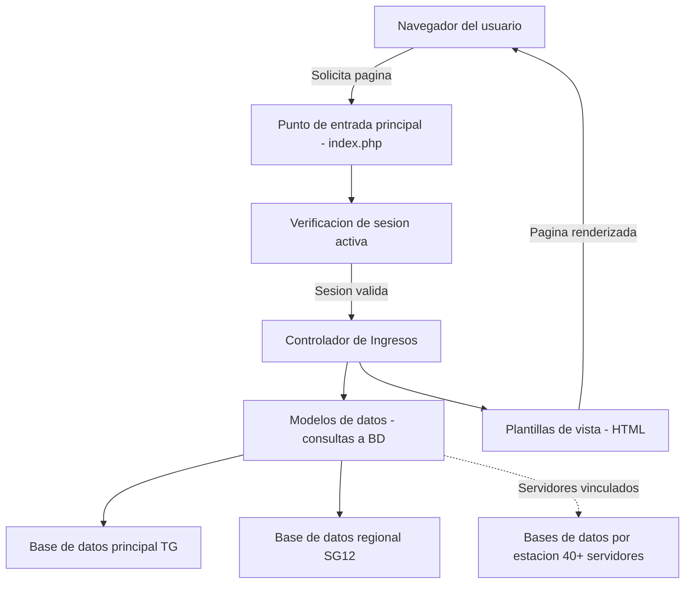
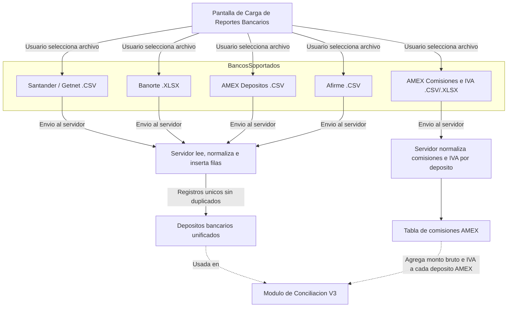
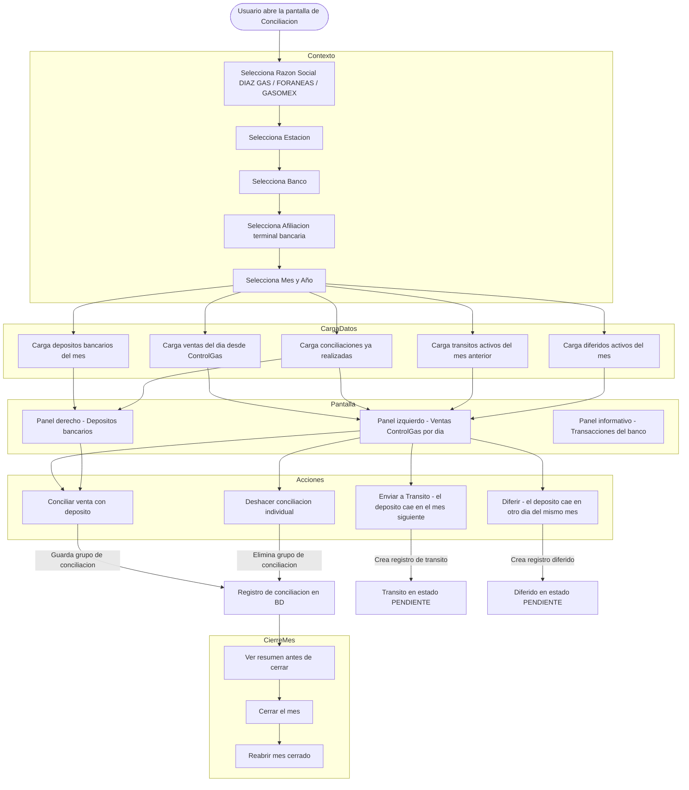
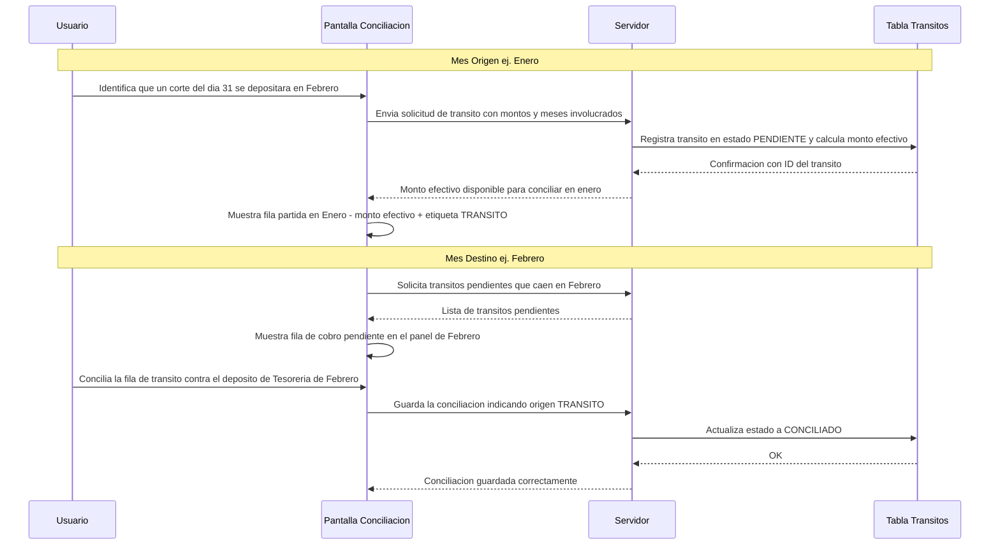
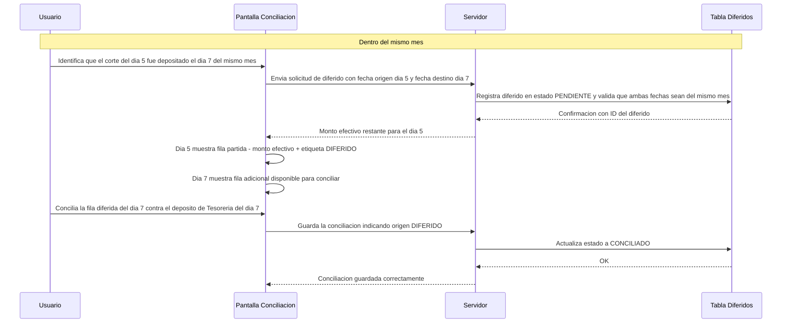
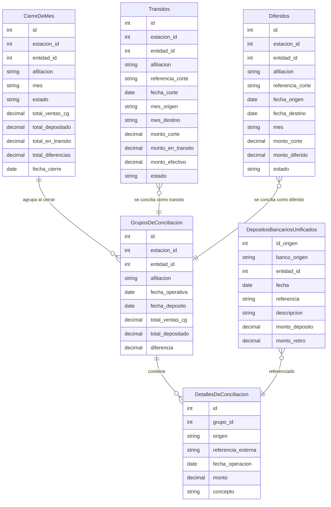
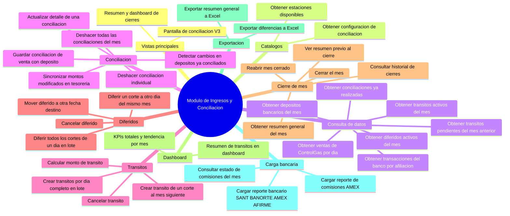
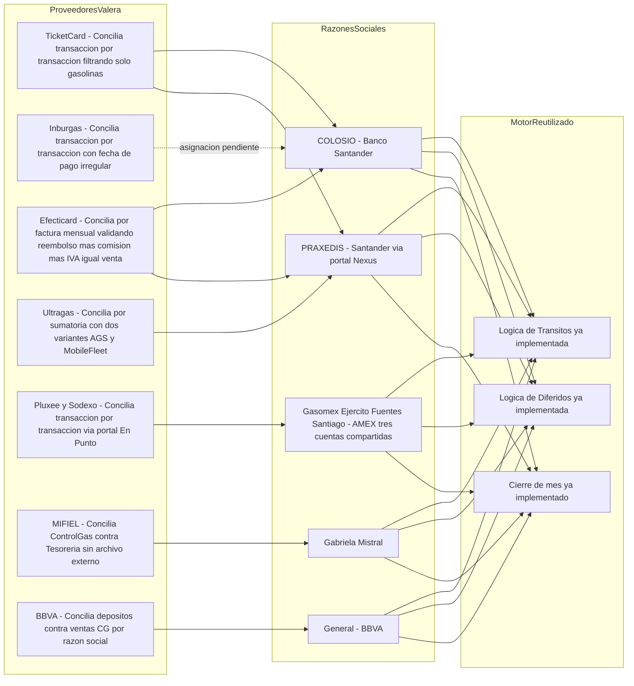

# Arquitectura de Software — TotalGas Modulo Income / Conciliacion V3

**Fecha de actualizacion:** 31/03/2026
**Version:** 3.0
**Responsable:** Desarrollo TotalGas

---

## 1. Descripcion General del Sistema

TotalGas es una aplicacion web PHP MVC personalizada para la gestion de operaciones de estaciones de gasolina en 40+ ubicaciones. El modulo **Income** cubre el ciclo de ingresos: ventas, carga de reportes bancarios, y conciliacion de depositos contra ventas de ControlGas.

### Stack tecnologico

| Capa | Tecnologia |
|---|---|
| Servidor web (produccion) | IIS con URL Rewrite a `index.php` |
| Servidor web (desarrollo) | PHP built-in `php -S localhost:8000 router.php` |
| Lenguaje backend | PHP (sin framework, MVC manual) |
| Plantillas | Twig 3.x |
| Base de datos | SQL Server via PDO `sqlsrv` |
| Frontend | Bootstrap 4 + jQuery + FontAwesome |
| Exportacion Excel | PhpSpreadsheet 2.x |
| Correo | PHPMailer via Gmail SMTP |

---

## 2. Flujo de Solicitudes

```
Navegador
  → index.php  (lee ?url=controlador/metodo)
  → Verifica sesion activa ($_SESSION)
  → Instancia controlador desde _assets/controllers/
  → Llama al metodo del controlador
  → Controlador usa modelos de _assets/models/
  → Renderiza vista Twig desde views/
  → Responde al navegador
```

Patron de URL: `/[controlador]/[metodo]/[params-opcionales]`
Ejemplo: `/income/test_v3` → `Income::test_v3()`

---

## 3. Arquitectura General



---

## 4. Archivos Clave del Modulo Income

| Archivo | Proposito |
|---|---|
| `_assets/controllers/income.php` | Controlador principal — 8700+ lineas, ~80 metodos |
| `_assets/models/IngresosModel.php` | Modelo base de ingresos |
| `views/income/test_v3.html` | Pantalla principal de conciliacion V3 |
| `views/income/upload_reports.html` | Pantalla de carga de reportes bancarios |
| `views/income/summary_v3.html` | Dashboard de cierres y KPIs |
| `_assets/classes/header.class.php` | Constantes, credenciales BD, zona horaria |
| `_assets/classes/common/MySqlPdoHandler.class.php` | Singleton de conexion PDO |

---

## 5. Flujo de Carga de Reportes Bancarios



### Nota tecnica de carga
Los archivos se leen en el navegador con `FileReader` y se envian como **Base64** al servidor para evitar el limite de `upload_max_filesize` de PHP. El servidor decodifica, parsea y normaliza antes de insertar. Un hash unico por registro (fecha + monto + referencia) evita duplicados aunque el archivo se cargue mas de una vez.

---

## 6. Flujo Principal de Conciliacion V3 (CG vs Tesoreria)

> **Cambio importante respecto a versiones anteriores:** La conciliacion se realiza entre las **ventas de ControlGas** y los **depositos de Tesoreria**. Las transacciones bancarias individuales aparecen como panel informativo de referencia, no como objeto principal de conciliacion.



---

## 7. Mecanismo de Transitos (deposito cruza de mes)

Un **transito** ocurre cuando una venta de un mes se deposita en el mes siguiente. El corte queda partido: una parte se concilia en el mes origen y la otra genera una fila pendiente en el mes destino.



---

## 8. Mecanismo de Diferidos (deposito dentro del mismo mes, dia distinto)

Un **diferido** ocurre cuando una venta de un dia se deposita en otro dia del **mismo mes**. A diferencia del transito, no cruza meses pero si cruza dias dentro del periodo activo.



---

## 9. Modelo de Base de Datos — Conciliacion V3



---

## 10. Mapa de Funciones del Modulo



---

## 11. Comparativa de Cambios Respecto a Version Anterior

| Concepto | Version anterior | Version actual |
|---|---|---|
| Objeto de conciliacion | CG vs Transacciones bancarias | CG vs Tesoreria (depositos); TX es panel informativo |
| Diferidos | No existia | CV3_Diferido — mueve parte de un corte a otro dia del mismo mes |
| Transitos | Basico | CV3_Transito — corte cuyo deposito cae en el mes siguiente |
| Razon Social | No segmentado | DIAZ GAS / FORANEAS / GASOMEX como filtro principal |
| Cierre de mes | No existia | cerrar_mes_v3 / reabrir_mes_v3 + banner de mes cerrado |
| AMEX Comisiones | No existia | Reporte separado de comisiones e IVA que enriquece el monto bruto |
| Deteccion de cambios | No existia | Detecta y sincroniza depositos modificados despues de conciliar |
| Fase 2 Valeras | No documentada | FRU redactado — TicketCard, Inburgas, Efecticard, Ultragas, Pluxee, MIFIEL, BBVA |

---

## 12. Roadmap — Fase 2: Conciliacion de Valeras


